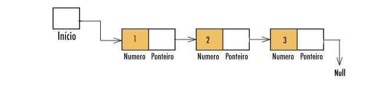

# Kryptus

## Aplicação em C usando lista encadeada

Funções implementadas:
* Get - Acessa o valor do elemento localizado na posição passa por parametro
* Put - Adiciona o valor passado por parametro ao final da lista
* Remove - Remove o valor passado por parametro
* Last - mostra o último elemento da lista
* First - mostra o primeiro elemento da lista
* sort - ordena a lista crescente ou decrescente usando bubble sort
